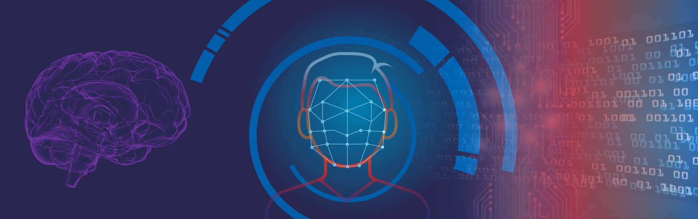
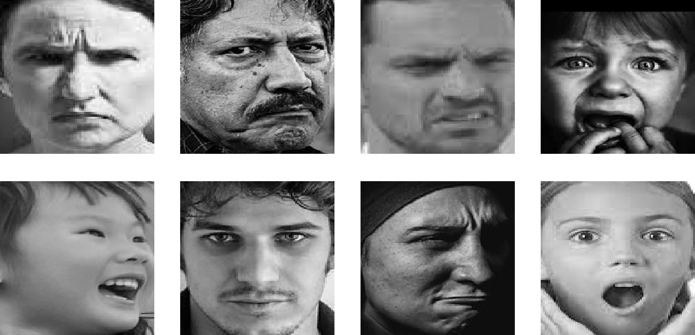

# Human Emotion Recognition  
  
This project aims to develop a machine learning model that can accurately classify human emotions based on facial expressions.  
Additionally, a second model has also been trained, for recognising if a face is human or not, for potential use in conjunction with the initial emotion recognition model.  
  

  
------------------------  
  
### Datasets
The dataset used for training and testing the emotion recognition model is made up of over 27,000 48x48 grayscale images of human faces, categorised into seven different categories based on facial expression: anger, disgust, fear, happiness, neutrality, sadness, and surprise.  
Sources: [1](https://www.kaggle.com/datasets/sudarshanvaidya/random-images-for-face-emotion-recognition), [2](https://www.kaggle.com/datasets/jonathanoheix/face-expression-recognition-dataset)  
  
  
The second dataset, used for the human face recognition model, is made up of images divided into "human" and "others".  
Source: [3](https://www.kaggle.com/datasets/prasunroy/natural-images)  
  
  
---------------------  
  
### Preprocessing  
To prepare the dataset for use:  
- Images were programmatically renamed for clarity, e.g. Anger images were renamed as: "an_0", "an_1", "an_2", etc.  
- Where necessary, images were resized and converted to grayscale.  
- Created a function for converting images to NumPy arrays.  
- Split both datasets into two, for training and testing.  
- Scaled the data using MinMaxScaler()
- One-Hot encoded the data using the Keras to_categorical() function.  
  
--------------
  
### Models  
The model has been built using a deep convolutional neural network (CNN) architecture. The CNN has been trained using the Adam optimizer and the categorical cross-entropy loss function.  
  
-----------------
  
### Validation
After training the two models with the testing split of either the human emotion recognition dataset or the human face recognition dataset, they have been validated on the testing split from their respective datasets.  
In training, the human emotion recognition model achieved an accuracy of ??? and a loss of ???, while the human face recognition model achieved an accuracy of ??? and a loss of ???.  
In testing, the human emotion recognition model achieved an accuracy of ??? and a loss of ???, while the human face recognition model achieved an accuracy of ??? and a loss of ???.  
  
---------------------
  
### Usage
The datasets used are located in the archive folder.  
The trained models have been exported and saved in the trained_models folder.  
The outputs of the code, including performance analysis figures, can be viewed in the emotion_model_cnn.ipynb and face_other_model.ipynb files.  
If you wish to run the code yourself, you will need to import the notebooks into Google Colab, and upload the archive folder into your Google Drive "My Drive" folder (the main folder).   
