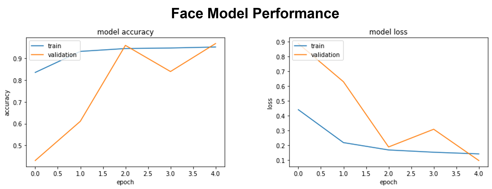
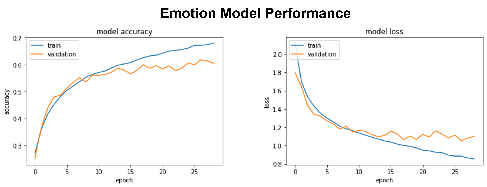

# Human Emotion Recognition  
  
This project aims to develop a machine learning model that can accurately classify human emotions based on facial expressions.  
Additionally, a second model has also been trained, for recognising if an image is a human face or not, for potential use in conjunction with the initial emotion recognition model.  
  

  
   
  
------------------------  
  
### Datasets
The dataset used for training and testing the emotion recognition model is made up of over 27,000 48x48 grayscale images of human faces, categorised into seven different categories based on facial expression: anger, disgust, fear, happiness, neutrality, sadness, and surprise.  
  

  

  

*Sources*: [1](https://www.kaggle.com/datasets/sudarshanvaidya/random-images-for-face-emotion-recognition), [2](https://www.kaggle.com/datasets/jonathanoheix/face-expression-recognition-dataset)  
  
   
  
The second dataset, used for the human face recognition model, is made up of images divided into "human" and "others". Images from the previous dataset were used for "human", while "others" contains images of various other things, such as cars, animals, plants, etc.  
  

  

  

*Source*: [3](https://www.kaggle.com/datasets/prasunroy/natural-images)  
  
   
  
---------------------  
  
### Preprocessing  
To prepare the dataset for use:  
- Images were programmatically renamed for clarity and ease of use, e.g. Anger images were renamed as: "an_0", "an_1", "an_2", etc.  
- Where necessary, images were resized and converted to grayscale.  
- Created a function for converting images to NumPy arrays, in which the values in the array are representative of the RGB values for each pixel.  
- Split both datasets into two, for training and testing.  
- Scaled the data using MinMaxScaler()
- One-Hot encoded the data using the Keras to_categorical() function.  
  
   
  
--------------
  
### Models  
Both of the models are Convolutional Neural Networks (CNN), as CNNs are among the most widely used and robust type of neural network for image processing. As with other neural networks, CNNs are made up of multiple layers of neurons. Here, the input layer takes in a grayscale image, which is then processing by the various hidden layers, containing the convolution, normalization, pooling, and fully connected layers. Finally, the output layer will provide a binary or multi-class label, which will indicate what the model has predicted.  
  
   
  
-----------------
  
### Validation
After training the two models with the testing split of either the human emotion recognition dataset or the human face recognition dataset, they were then validated using the testing split from their respective datasets.  
The human face recognition model was extremely successful, achieving a validation accuracy of >90%.  
  

  

 
  
While the human emotion recognition model achieved a Top1 accuracy of >60%, and a Top3 accuracy of >88%.  
*(Top1 = the model outputs the one prediction it deems most likely; Top3 = the model outputs it's 3 predictions it deems most likely, ordered from most to least likely, the prediction is deemed correct if the correct answer is in these top 3 answers)*  
  

  

 
  
While the face model was more successful than the emotion model, overall we are extremely satisfied with the performance of both models. During initial research, we came across the VGG16 model, an extremely well made and successful CNN model for image processing. Due to this, we used it as an example of good CNN model architecture. Even the VGG16 model is only capable of reaching a Top1 accuracy of 71.592 and a Top5 accuracy of 90.382 ([4](https://pytorch.org/vision/main/models/generated/torchvision.models.vgg16.html), [5](https://github.com/ashushekar/VGG16)). So, with the VGG16 model providing some perspective, we consider the accuracy these two models were able to achieve a huge success, given the time constraints of this project and the relatively low processing power at our disposal.  
  
   
  
---------------------
  
### Usage
The datasets used are located in the archive folder in .zip files, due to their large size. Additionally, the sources which the data was acquired from are linked above, under the *Datasets* subheading.  
The trained models have been exported and saved in the trained_models folder.  
The rename_img.py file contains the code used for programmatically renaming the images during preprocessing.  
  
The code and it's outputs, including performance analysis figures, can be viewed in the face_model.ipynb and emotion_model.ipynb files.  
The testing_model.ipynb file serves as an application of the two models, as it has both models imported in for use together on images which were not within the original datasets. First, the image is shown to the face model, which will determine if it is a human face or not. If it is a human face, then it will pass the image along to the emotion model, which will then predict and output what emotion it is most likely to be, the model's calculated probability of how likely it is to be each emotion will also be output. If the face model determines the image is something other than a human face, then the image will not be passed along to the emotion model.  
  
The test_image folder contains the images used in the testing_model.ipynb notebook.  
  
The excel files, emotion_model_optimization.xlsx and face_other_model_optimization.xlsx (which are located within the model_optimization folder), serve as records containing detailed information on the various different parameters and variables tested during development and refinement of the models.  
  
Note: To run this in Google Colab, you need to unzip the emotion.zip and face.zip files located in the archive folder and upload the archive folder into your Google Drive "My Drive" folder (the main folder).  
